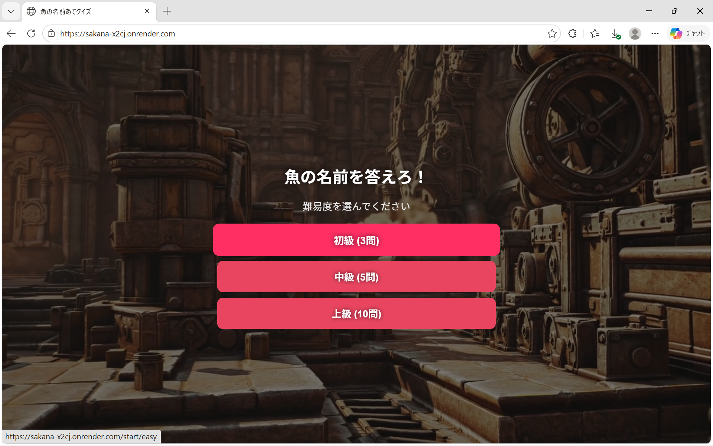
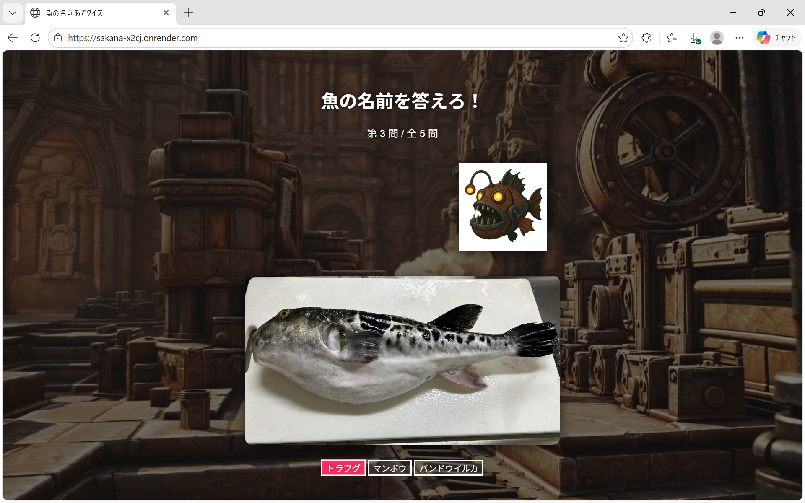
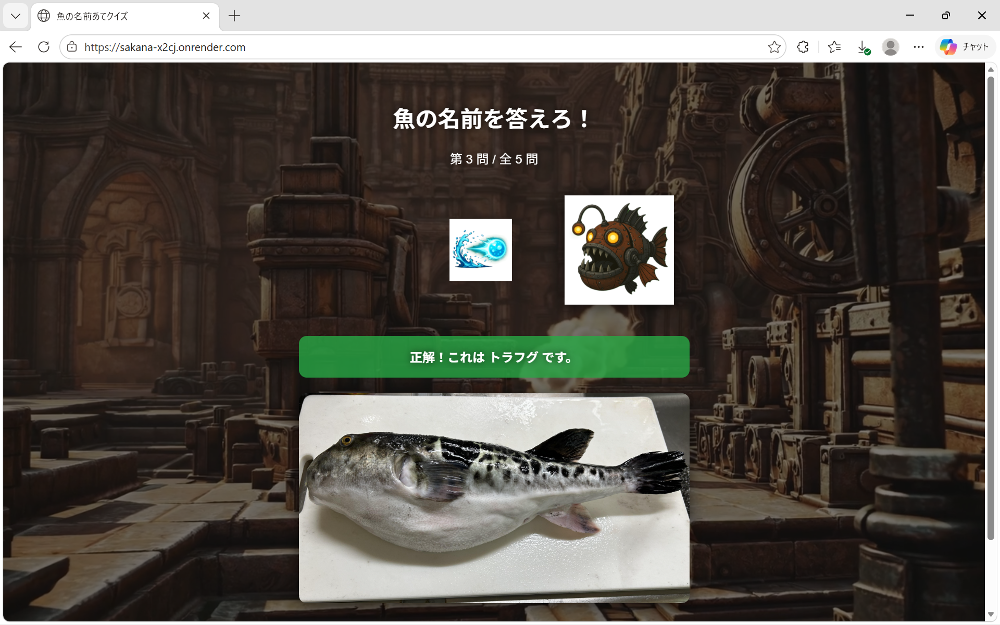
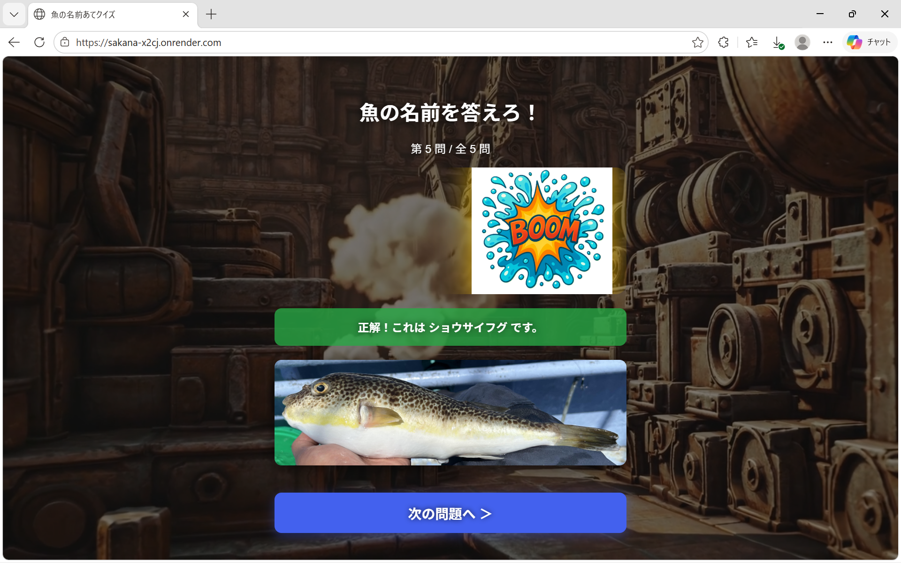
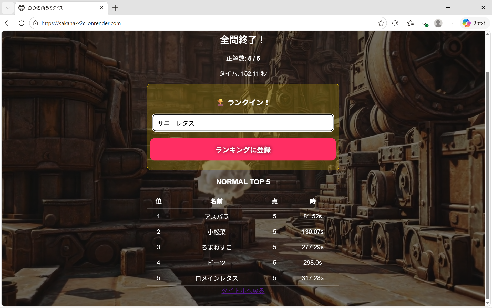

# 🐟 魚の名前当てクイズ

ブラウザで遊べる魚クイズゲームです。
表示される魚の画像を見て、正しい名前を当てましょう！

---

## 🎥 デモ

タイトル → クイズ → 正解 → ボス撃破までの流れ


---

## 📸 スクリーンショット

### タイトル画面



### クイズ画面



### 正解演出



### ボス撃破



### ランキング画面



---

## 🎮 遊び方

1. タイトル画面で難易度を選択

   * 初級（3問）
   * 中級（5問）
   * 上級（10問）

2. 魚の画像が表示されるので名前を回答

   * 一部は選択式
   * 一部は入力式（ひらがな・カタカナ対応）

3. 正解すると攻撃エフェクト発生 💥

4. 全問終了後に結果表示

   * 正解数
   * タイム
   * ランキング

5. 全問正解するとボス撃破演出（爆発エフェクト）

---

## ✨ ゲーム仕様

* 問題はランダムに出題
* 一部の問題は選択肢付き
* スコアとタイムでランキング判定
* 上位5位まで保存（PostgreSQL）

---

## 🏆 ランキング機能

* 各難易度ごとにランキングを記録
* 上位5件のみ保持
* 同点の場合はタイムが短い方が上位

---

## 🎨 演出

* 攻撃エフェクト
* ダメージ演出
* ボス撃破時の爆発演出
* 画面フラッシュ＆揺れ（最終演出）

---

## 🛠 使用技術

* Python（Flask）
* HTML / CSS / JavaScript
* PostgreSQL（Render）
* Gunicorn

---

## 🚀 デプロイ（Render）

### 事前準備

* GitHubにこのリポジトリをアップロード

### Render設定

* Runtime: Python 3

* Build Command:

  ```
  pip install -r requirements.txt
  ```

* Start Command:

  ```
  gunicorn app:app
  ```

---

## 🧑‍💻 制作背景

Web開発の学習の一環として、ゲーム要素を取り入れたアプリケーションを制作しました。
ユーザーが楽しみながら操作できるUI/UXと、状態管理や演出制御の実装を目的としています。

---

## 🎯 工夫した点

* Flaskのセッションを用いたクイズ進行管理
* 正解時の演出（攻撃エフェクト・爆発演出）の実装
* 難易度ごとの出題ロジックの切り替え
* スコアとタイムによるランキング機能（PostgreSQL）

---

## 🎯 技術的に学んだこと

* Flaskを用いた状態管理（セッション制御）
* Jinja2による条件分岐レンダリング
* CSSアニメーションによるゲーム演出
* GitHubを用いたバージョン管理
* Renderを用いたWebアプリのデプロイ

---

## 🚀 今後の改善

* HPゲージの追加
* 効果音の実装
* モバイル最適化

---
